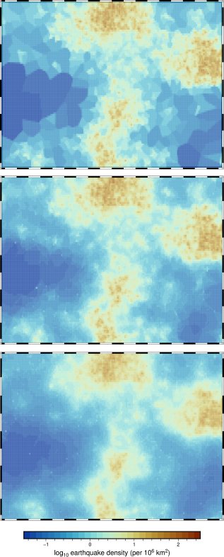

# VSM: Voronoi-based Seismicity Models
Computer-programs for the construction of seismicity models and maps based on Voronoi diagrams.

>[!WARNING]
>:warning: ***Documentation under-construction...***

<p align="left">
    
</p>

> [!NOTE]
> For citation and a detailed presentation of the method, see:\
> **Daniel, G., and Arroucau, P., 2025, Data-driven seismicity models based on Voronoi diagrams, _in preparation_**

> [!CAUTION]
> Use this program at your own risks! We cannot guarantee the exacteness and the reliability of any program included in this repository.

## Package contents ##
This package consists in two main modules added of a suite of utilities for plotting or validation purposes:\
* **`voronoi2density.py`**: Calculation of earthquake count/density grids based on Voronoi diagrams of a set of epicentral locations. This program can also propagate earthquake location and magnitude uncertainties using a random Monte-Carlo sampling process. This tends to produce a data-driven smoothing of spatial seismicity patterns. One count/density grid is constructed for each magnitude bin and is then projected onto a regular spatial mesh.
* **`compute_ab_values.py`**: Modelling of Frequency-Magnitude Distributions (FMD). This program uses a collection of count/density grids over several magnitude bins to reconstruct a FMD for each pixel of the regular spatial mesh. The program also estimates and returns a grid of parameters _a_ and _b_ from the Gutenberg & Richter law[^1] in each pixel.
* <ins>Plotting utilities</ins>:
  * **`plot_fmd.py`**: Plot the Frequency-Magnitude Distribution for one, or several, pixels
  * **`plot_map.py`**: Plot a map of earthquake counts/densities or _a_/_b_-values of the Gutenberg & Richter relationship
  * **`plot_distrib.py`**: Plot for one pixel of the regular grid the distribution of any quantity stored in GMT-formatted multiple segment files (_i.e.,_ counts, densities, _a_ or _b_). This can be useful to inspect the distributions produced by the propagation of uncertainties using `voronoi2density.py`.  
    
* <ins>Testing utilities</ins>:
  * **`gof_tests.py`** : ***[ Under development ].*** Goodness-of-fit tests based on residual analysis.

## Examples / Use-cases ##
Tutorials and examples will be included to assist interested users with our input formats, and with the use of the programs.


### Calculation of earthquake counts/density per magnitude bin ###
<ins>*Syntax*</ins>: `python voronoi2density.py parameters.txt`
> [!NOTE]
> A full list of available options can be obtained using the `-h` flag, _i.e.,_ `python voronoi2density.py -h`.

### Estimation of (_a_, _b_) parameters of the Gutenberg & Richter law[^1] ###
<ins>*Syntax*</ins>: `python compute_ab_values.py parameters.txt`
> [!NOTE]
> A full list of available options can be obtained using the `-h` flag, _i.e.,_ `python compute_ab_values.py -h`.

### Plot Voronoi diagram for one magnitude bin ###

### Plot a map of earthquake count/density for one magnitude bin ###

### Plot a map of _a_-values ###

### Plot FMDs for a collection of pixels ###


## File formats ##

### Input files ###
* **Configuration file** (_e.g.,_ `parameters.txt`): Define the list of input files and settings for each application. Each line starting with "#" is considered as a comment and skipped.
  ```
  # VSM CONFIGURATION FILE
  # -- Define input files and output directories --
  file_for_epicenters: epicenters_synthetics.txt
  file_for_geographical_bounds: bounds.txt
  file_for_magnitude_bins: bins.txt
  #file_for_FMD_limits_and_durations: fmd_info.txt
  #file_for_prior_b_information: b_prior_info.txt
  output_directory_for_files: results
  output_directory_for_figures: figures
  # -- Specification of input CRS and internal CRS used for the computation of areas --
  input_CRS: EPSG:4326 
  # NB: EPSG:4326 --> WGS-84
  internal_equal_area_CRS: EPSG:2154  
  # NB: EPSG:2154 --> Lambert 93
  unit_for_internal_CRS_coordinates: m
  # -- Calculation settings --
  mesh_discretization_step: 0.5 deg
  # NB: available units for step: km, deg
  density_scaling_factor: 1000.0
  skip_ab_if_missing_priors: True
  define_completeness_automatically: False
  enable_verbosity: True
  # -- Options governing the propagation of uncertainties --
  nb_bootstrap_samples: 100
  perturb_magnitudes: True
  save_bootstrap_realizations: False
  nb_parallel_tasks: 3
  b_value_to_remove_bias_on_perturbed_magnitudes: 1.0
  save_bootstrap_realizations: False
    ```
* **Magnitude bin information file** (_e.g.,_ `bins.txt`): Definition of magnitude bins.\
  One bin per line, with columns arranged in the following order: `[ID] [MIN] [MAX] [TMIN] [TMAX]`. Each line starting with "#" is considered as a comment and skipped.
  ```
  # VSM MAGNITUDE BIN CONFIGURATION
  # [ID] [MIN] [MAX] [TMIN] [TMAX]
  1	2.0	2.5	0.0	10000.0
  2	2.5	3.0	0.0	10000.0
  3	3.0	3.5	0.0	10000.0
  4	3.5	4.0	0.0	10000.0
  5	4.0	4.5	0.0	10000.0
  6	4.5	5.0	0.0	10000.0
  7	5.0	5.5	0.0	10000.0
  8	5.5	6.0	0.0	10000.0
  9	6.0	6.5	0.0	10000.0
  10	6.5	7.0	0.0	10000.0
  ```
  
* **Target geographical area** (_e.g.,_ `bounds.txt`): Define the target geographical area.\
  Bounds can be specified in two forms:
    - rectangular area, or
    - any area enclosed in a specified polygon

   Each line starting with "#" is considered as a comment and skipped.
  
  <ins>Example format for a rectangular area</ins>: 
  It is defined by its 4 corners, with columns arranged in `[LON] [LAT]` order. 
  ```
  # VSM TARGET GEOGRAPHICAL AREA
  -7.25  41.75
  11.25  41.75
  11.25  51.25
  -7.25  51.25
  ```

  <ins>Example format for an area enclosed in a polygon</ins>: \
  It is defined by its 4 corners, with columns arranged in `[LON] [LAT]` order. The example below represents the polygon enclosing the Californian area used in the RELM[^2] earthquake forecasting experiment.
  ```
  # VSM TARGET GEOGRAPHICAL AREA
  -125.4  43.0
  -118.16447368421052  43.0
  -113.4  35.9
  -113.1  35.45
  -113.1  32.18333333333337
  -113.2  31.8
  -113.3  31.7
  -113.5  31.6
  -113.7  31.5
  -118.36842105263159  31.5
  -121.40  33.3
  -121.5  33.4
  -121.7  33.6
  -122.0  33.9
  -122.2  34.2
  -123.2  35.7
  -124.7  38.0
  -125.4  39.1
  -125.4  39.1
  -125.4  43.0
  ```
* **Earthquake catalogue** (_e.g.,_ `epicenters.txt`): Catalogue of earthquake epicentral locations with location and magnitude uncertainties.\
  One epicenter per line. Each line starting with "#" is considered as a comment and skipped.\
  Two formats are available, depending on whether uncertainties are included in the catalogue, or not:
  - <ins>without uncertainties</ins>, columns are arranged in the following order: `[FLOATING DATE] [LON] [LAT] [MAG]`
  - <ins>with uncertainties</ins>, columns are arranged in the following order: `[FLOATING DATE] [LON] [LAT] [MAG] [HALF-LENGTH OF SEMI-MAJOR AXIS IN KM] [HALF-LENGTH OF SEMI-MINOR AXIS IN KM] [AZIMUTH OF SEMI-MAJOR AXIS in DEG] [MAG UNCERTAINTY]`
  ```
  # VSM EARTHQUAKE EPICENTERS 
  # 1 EVENT PER LINE
  # COORDINATES EXPRESSED IN GEOGRAPHICAL COORDINATES (EPSG:4326)	
  # LINE FORMAT: Floating_Date  Longitude  Latitude  Magnitude  Loc_Unc_SMAJ  Loc_Unc_SMIN  Loc_Unc_Az  Mag_Unc
  1522.479452	0.75	46.917	5.8	100.0	100.0	0.0	0.43
  1579.068493	2.0	46.583	6.0	50.0	50.0	0.0	0.47
  1580.262295	1.5	51.0	5.8	50.0	50.0	0.0	0.49
  1618.501370	-0.617	43.2	5.1	50.0	50.0	0.0	0.48
  1640.510929	-1.367	48.933	5.2	100.0	100.0	0.0	0.42
  1650.720548	7.6	47.55	5.3	50.0	50.0	0.0	0.44
  1657.123288	0.617	47.117	5.7	50.0	50.0	0.0	0.51
  1663.035616	-0.75	46.95	5.3	100.0	100.0	0.0	0.5
  1665.093151	-0.05	43.1	5.4	100.0	100.0	0.0	0.43
  1672.945355	7.75	47.483	5.6	50.0	50.0	0.0	0.45
  1678.668493	5.783	43.75	5.0	100.0	100.0	0.0	0.4
  ```
   
* **[Optional] FMD properties for each pixel** (_e.g.,_ `fmd_info.txt`): Describes the bounds and completeness periods of frequency-magnitude distributions (FMD) for each pixel of the grid output by the program `voronoi2density.py`. When completeness durations are specified in this file, they replace durations provided in the Magnitude Bin Configuration file, see above.
One line per pixel, with semicolumn-delimited columns. Each line starting with "#" is considered as a comment and skipped.\
Columns order: [CENTRAL LON] [CENTRAL LAT] [MMIN] [MMAX] [COMPLETENESS DURATION BIN 1] [COMPLETENESS DURATION BIN 2] ... [COMPLETENESS DURATION BIN N]\
The first 3 columns are mandatory, others are optional. 
 
  ```
  # VSM FMD INFORMATION FILE
  # LINE FORMAT: lon; lat; mmin; mmax; dur_1; dur_2; dur_3; dur_4; dur_5; dur_6; dur_7
  -4.95; 43.85; 3.0; 6.5; 55.0; 60.0; 70.0; 220.0; 220.0; 220.0; 220.0
  -4.95; 43.95; 3.0; 6.5; 55.0; 60.0; 70.0; 220.0; 220.0; 220.0; 220.0
  -4.95; 44.05; 3.0; 6.5; 55.0; 60.0; 70.0; 220.0; 220.0; 220.0; 220.0
  -4.95; 44.15; 3.0; 6.5; 55.0; 60.0; 70.0; 220.0; 220.0; 220.0; 220.0
  -4.95; 44.25; 3.0; 6.5; 55.0; 60.0; 70.0; 220.0; 220.0; 220.0; 220.0
  ```
  Special values:
  - `mmax = -9.0`: Use an untruncated Gutenberg-Richter relationship for the pixel (_i.e.,_ equivalent to `mmax = inf`)
  - `mmax = NaN`: Use an untruncated Gutenberg-Richter relationship for the pixel (_i.e.,_ equivalent to `mmax = inf`)
  - missing `mmax`: Use an untruncated Gutenberg-Richter relationship for the pixel (_i.e.,_ equivalent to `mmax = inf`)


* **[Optional] Prior _b_-value information for each pixel** (_e.g.,_ `b_prior_info.txt`): Provides optional constraints on _b_-values for each pixel in the grid output by the program `voronoi2density.py`. These constraints are expressed in terms of an _a-priori_ <ins>normal</ins> distribution on _b_-values, parameterized by its <ins>mean</ins> and its <ins>standard-deviation</ins>. The estimation of (_a_, _b_) parameters for all pixels is realized by execution of the program `compute_ab_values.py`, which loads this _a-priori_ information only if the filename is listed in the configuration file. One line per pixel, with semicolumn-delimited columns. Each line starting with "#" is considered as a comment and skipped.\
  Columns order: [CENTRAL LON] [CENTRAL LAT] [B_MEAN] [B_STD_DEV]
  ```
  # B-PRIOR INFORMATION FILE
  # LINE FORMAT: lon; lat; b_mean; b_std
  -4.95; 47.75; 1.01; 0.1
  -4.95; 47.85; 1.01; 0.1
  -4.95; 47.95; 1.01; 0.1
  -4.95; 48.05; 0.96; 0.1
  -4.95; 48.15; 0.96; 0.1
  -4.95; 48.25; 0.96; 0.1
  -4.95; 48.35; 0.96; 0.1
  -4.95; 48.45; 0.96; 0.1
  -4.95; 48.55; 0.96; 0.1
  -4.95; 48.65; 0.96; 0.1
  -4.95; 48.75; 0.96; 0.1
  ```
  Special values:
   - `b_mean = 0.0` <ins>and</ins> `b_std = 0.0`: Flags indicating the absence of _a-priori_ distribution for the pixel
   - `b_mean = -9.0` <ins>and</ins> `b_std = -9.0`: Flags indicating the absence of _a-priori_ distribution for the pixel


### Output files ###
#### Produced by voronoi2density.py ####
* **Earthquake counts per pixel (for each magnitude bin)** (_e.g.,_ `counts_bin_i.txt`): GMT-formatted ASCII polygon file listing, for each pixel, the number of earthquake counts with magnitudes included in bin _i_. Each pixel is described by its 4 vertices. Z-values correspond to the estimated earthquake count within each pixel.

* **Summary table of earthquake counts (for all bins and all pixels)** (_e.g.,_ `gridded_counts.txt`): Table of earthquake count values for every bin and for every pixel in the target area, in CSV formatted, delimited by semi-colons (";"). One pixel per line. Number of columns is equal to the number of magnitude bins + 2.\
Columns order: [CENTRAL LON] [CENTRAL LAT] [COUNTS IN BIN 1] [COUNTS IN BIN 2] ... [COUNTS IN BIN i]

* **Earthquake density per pixel (for each magnitude bin)** (_e.g.,_ `density_bin_i.txt`): GMT-formatted ASCII polygon file listing, for each pixel, the spatial density of earthquakes with magnitudes included in bin _i_. Each pixel is described by its 4 vertices. Density is obtained by dividing earthquake counts by pixel area. Z-values correspond to the spatial density of earthquake within each pixel.

* **Summary table of earthquake densities (for all bins and all pixels)** (_e.g.,_ `gridded_densities.txt`): Table of earthquake densities for every bin and for every pixel in the target area, in CSV formatted, delimited by semi-colons (";"). One pixel per line. Number of columns is equal to the number of magnitude bins + 2.\
Columns order: [CENTRAL LON] [CENTRAL LAT] [DENSITY IN BIN 1] [DENSITY IN BIN 2] ... [DENSITY IN BIN i]

* **Voronoi polygons (for each magnitude bin):** (_e.g.,_ `polygons_bin_i.txt`): GMT-formatted ASCII polygon file listing all Voronoi polygons of the diagram obtained from epicentral locations of earthquakes with magnitudes included in bin _i_. Z-values correspond to the spatial density of earthquake within each polygon. This file is only produced when the random sampling of catalogue uncertainties is deactivated (_i.e._, option `nb_bootstrap_samples` set to 0). When uncertainties are propagated, a similar output can be produced for each random realisation by activating option `save_bootstrap_realizations: True` in the [**Configuration file**](#Input-files).

* **<ins>Supplementary outputs</ins> when uncertainties are propagated using Monte-Carlo random sampling**:
  The following files report standard deviations of earthquake count and density estimates when the option `nb_bootstrap_samples: ` is set with any number greater than 0 in the [**Configuration file**](#Input-files).

    * **Standard-deviation of earthquake counts per pixel (for each magnitude bin)** (_e.g.,_ `counts_std_bin_i.txt`): GMT-formatted ASCII polygon file listing, for each pixel, the standard-deviation of earthquake counts for events with magnitudes included in bin _i_. Each pixel is described by its 4 vertices. These files are only created when uncertainties are propagated by random sampling of catalogue uncertainties (_i.e._, when option `nb_bootstrap_samples` set to a number greater than 0).
    
    * **Standard-deviation of earthquake density per pixel (for each magnitude bin)** (_e.g.,_ `density_std_bin_i.txt`): GMT-formatted ASCII polygon file listing, for each pixel, the standard-deviation of the spatial density of earthquakes with magnitudes included in bin _i_. Each pixel is described by its 4 vertices. These files are only created when uncertainties are propagated by random sampling of catalogue uncertainties (_i.e._, when option `nb_bootstrap_samples` set to a number greater than 0).
    
    * **Summary table of pixel-wise earthquake count standard deviations (for all bins)** (_e.g.,_ `gridded_counts_std.txt`): Standard deviations of earthquake counts for every bin in each pixel. CSV format, same organisation than in file `gridded_counts.txt`
    
    * **Summary table of pixel-wise earthquake density standard deviations (for all bins)** (_e.g.,_ `gridded_densities_std.txt`): Standard deviations of earthquake density for every bin in each pixel. CSV format, same organisation than in file `gridded_densities.txt`
 
    * **<ins>Optional outputs</ins> for each realization of the Monte-Carlo random sampling process**:
The next files store intermediary results produced during the Monte-Carlo random sampling process for the propagation of uncertainties.\
For each realization, a new catalogue is built from the original catalogue, where earthquake locations (and optionally, magnitudes) are randomly drawn within the uncertainty domain specified in the original catalogue. Then, the process produces a Voronoi diagram based on this new catalogue, and it estimates earthquake counts and densities over the target gridded area from this diagram.
The last step consists in averaging counts and densities over all realizations, and in storing final results in files `gridded_counts.txt` and `gridded_densities.txt`.\
Storing of intermediary results (catalogue, Voronoi polygons and pixel-wise estimates of earthquake counts and densities) can be activated by setting option `save_bootstrap_realizations: True`. By default, this option is deactivated (set to `False`).

        * **Random catalogue realization** (_e.g.,_ `bootstrap/catalog_bin_i_bs_j.txt`): Random realization of the earthquake catalogue for bin _i_ and for realization index _j_. This data is stored using a semi-colon (";")-delimited ASCII format with 4 columns.\
          Columns order: [TIME] [LONGITUDE] [LATITUDE] [MAGNITUDE]
        
        * **bootstrap/counts_bin_i_bs_j.txt**
        
        * **bootstrap/density_bin_i_bs_j.txt**
        
        * **bootstrap/polygons_bin_i_bs_j.txt**


[^1]: Gutenberg, B., and Richter, C. F., 1944, Frequency of Earthquakes in California, _Bulletin of the Seismological Society of America_, 34, 4, pp.185-188.
[^2]: Field, E. H., 2007, Overview of the Working Group for the Development of Regional Earthquake Likelihood Models (RELM), Seismological Research Letters, 78, 1, pp.7-16
